# 🏥 Appointment Booking System for Hospitals

## 📖 Project Overview

This web application is designed to streamline the hospital appointment process. It enables:
- ✅ *Patients* to register and book appointments
- ✅ *Doctors* to manage appointments and schedules
- ✅ *Admins* to monitor and manage the system efficiently

---

## 🌟 Key Features

### 👤 Patient Features
- Register and Log In securely to book appointments
- Book Appointments by selecting doctor, date, and available time slot
- View Upcoming Appointments and cancel/manage them if needed
- Check Appointment History for completed or cancelled bookings
- Download PDF confirmation slips for each appointment
- Update Profile and change password from dashboard

### 🩺 Doctor Features
- Log In to Doctor Dashboard and view today’s appointments
- Manage Appointments: confirm, complete, or cancel them
- View Patient Details for upcoming appointments
- Check Appointment History to review past consultations
- Download PDF Reports of today’s schedule or full appointment history
- Edit Doctor Profile and update login details

### 🛠 Admin Features
- Access Admin Dashboard with system stats (users, doctors, appointments)
- Manage Users:
  - View, add, edit, or delete patients and doctors
  - Filter by role or search by name/email
- Manage Appointments:
  - View all system-wide appointments
  - Edit or cancel any appointment
- View Appointment History across the system
- Export Reports as PDFs for today's schedule or complete history

---

## 🛠 Technologies Used

| Technology     | Purpose                         |
|----------------|---------------------------------|
| HTML/CSS       | Frontend Markup & Styling       |
| Bootstrap      | Responsive UI Framework         |
| JavaScript     | Client-side Interactivity       |
| Laravel        | Backend Framework (PHP)         |
| MySQL          | Database                        |
| Vite           | Laravel Asset Bundler           |
| PDF Library    | Export Appointment Reports      |
| Git + GitHub   | Version Control & Collaboration |

---


## 🖥 Screenshots


- ### Homepage  
  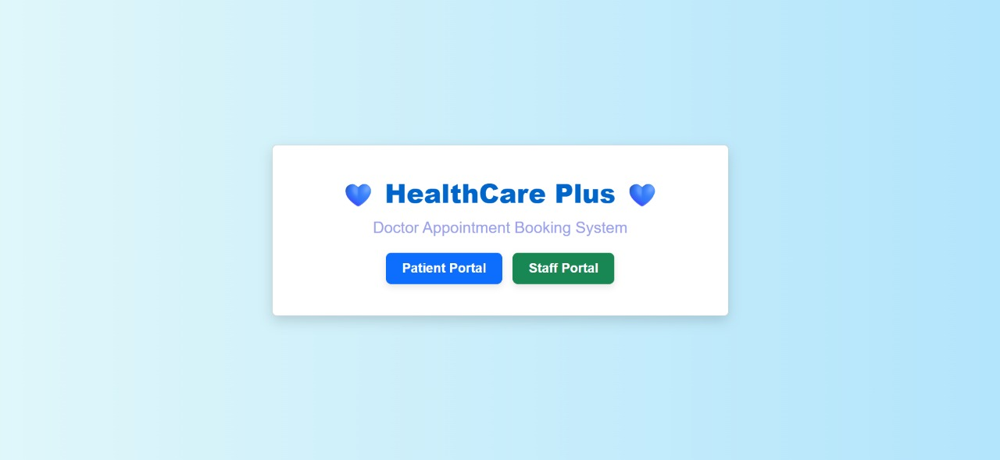

  ---

- ### Patient Login Form
  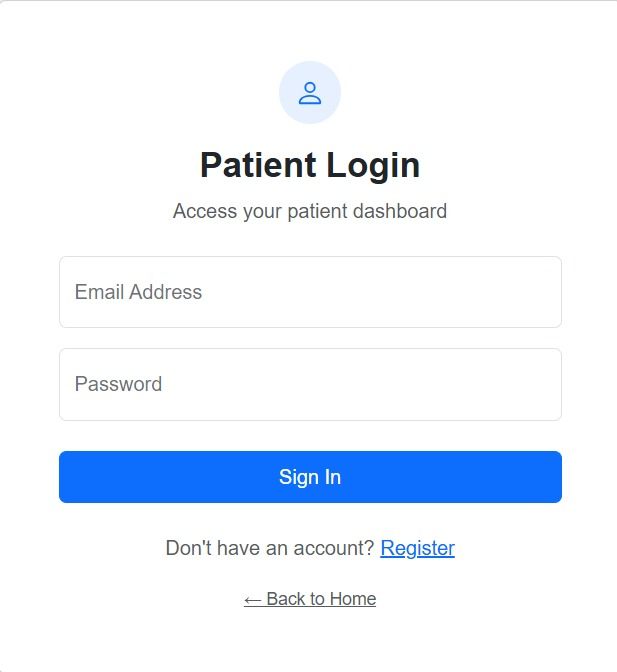

  ---

- ### Patient Registration Form
  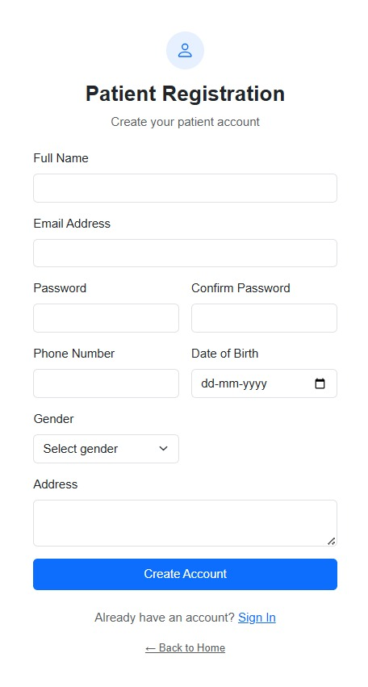

  ---

- ### Staff Login Form
  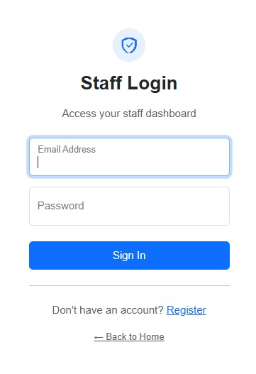

  ---

- ### Staff Registration Form
  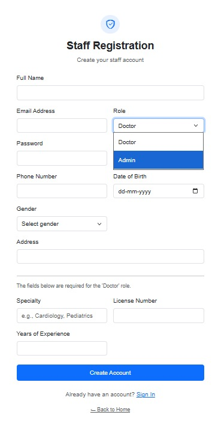

  ---

- ### Patient Dashboard  
  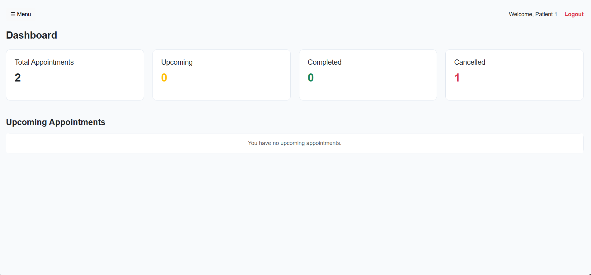

  ---

- ### Patient Appointment Booking
  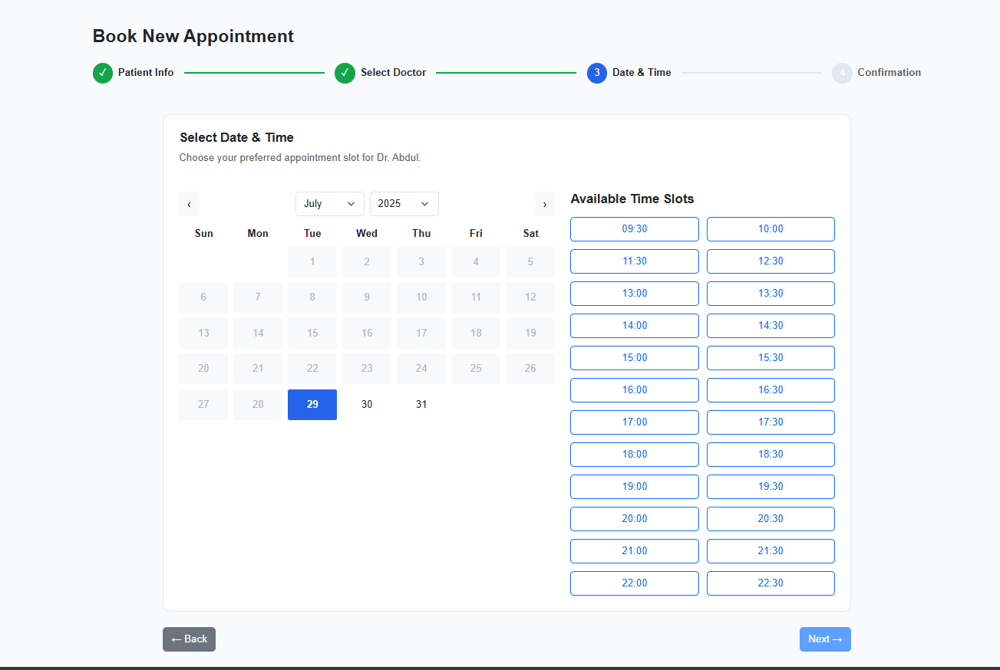

  ---

- ### Doctor Dashboard
  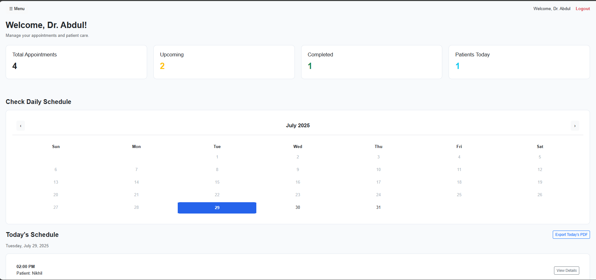

  ---

- ### Doctor Appointments
  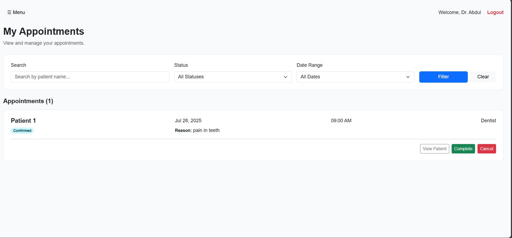

  ---

- ### Doctor Appointment History
  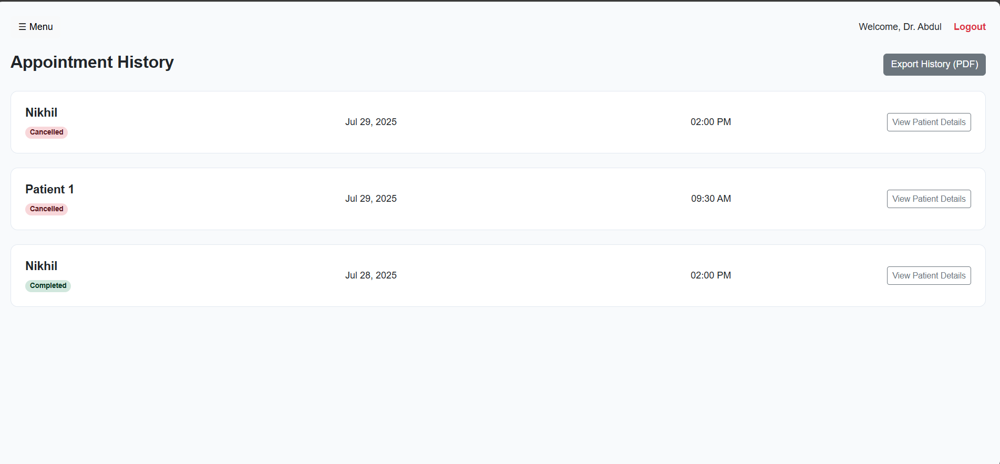

  ---

- ### Admin Dashboard
  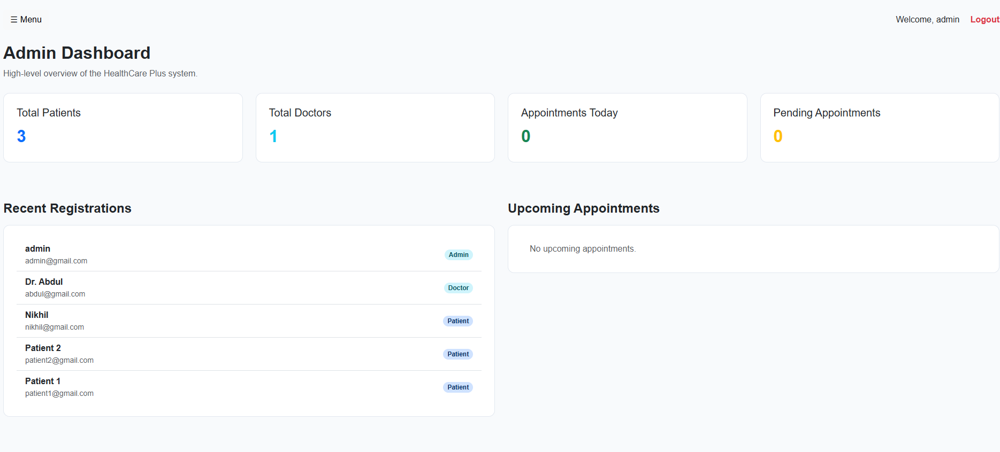

  ---

- ### User Management
  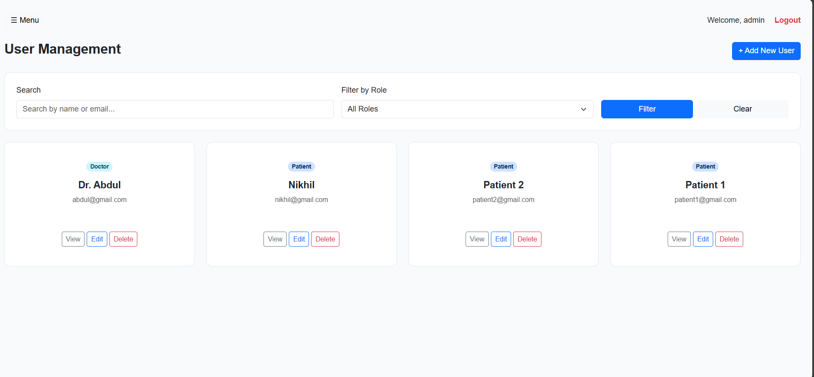

  ---

- ### All Appointments
  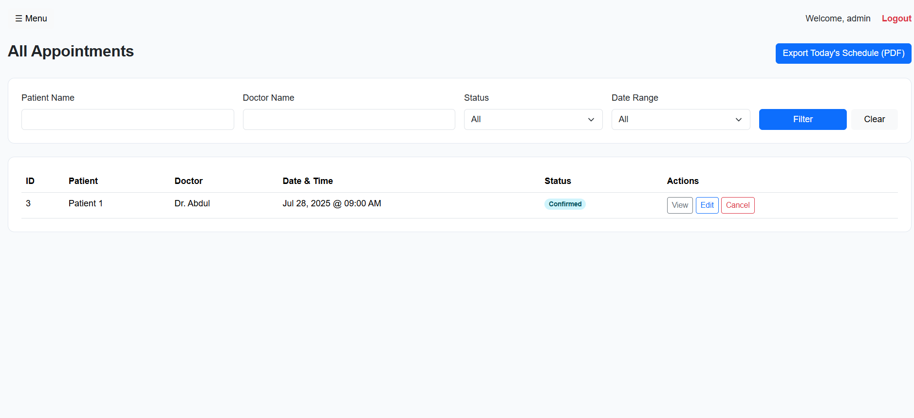


---
## 🚀 Installation Guide


### 1. Clone the repository
```bash
git clone https://github.com/nikhilgunadala/Appointment-Booking-System.git
cd Appointment-Booking-System
```


### 2. Install dependencies
```bash
composer install
npm install
```

### 3. Copy .env and Set Environment Variables
bash
cp .env.example .env


#### update the .env file with
```bash
DB_CONNECTION=mysql
DB_HOST=127.0.0.1
DB_PORT=3306
DB_DATABASE=your_database_name
DB_USERNAME=your_mysql_user
DB_PASSWORD=your_mysql_password
```

### 4. Generate App Key
```bash
php artisan key:generate
```

### 5. Set Up the Database
```bash
php artisan migrate
php artisan db:seed
```

### 6. Run the Vite Dev Server
```bash
npm run build
```

### 7. Start the Laravel Server
```bash
php artisan serve
```


---


## 📦 Deployment

Our project is successfully deployed and live!

 **Live Website:**  
 [https://appointment-booking-system.up.railway.app/](https://appointment-booking-system.up.railway.app/)


### 🚀 How We Deployed

- *Hosting Platform:* [Railway.app](https://railway.app/)  
  A modern cloud platform ideal for Laravel apps with free MySQL database hosting.

- *Deployment Method:* Docker  
  We used a Dockerfile to create a consistent environment for the application.

- *Environment Variables:*  
  All sensitive data is stored securely using Railway's environment variable system.


---
